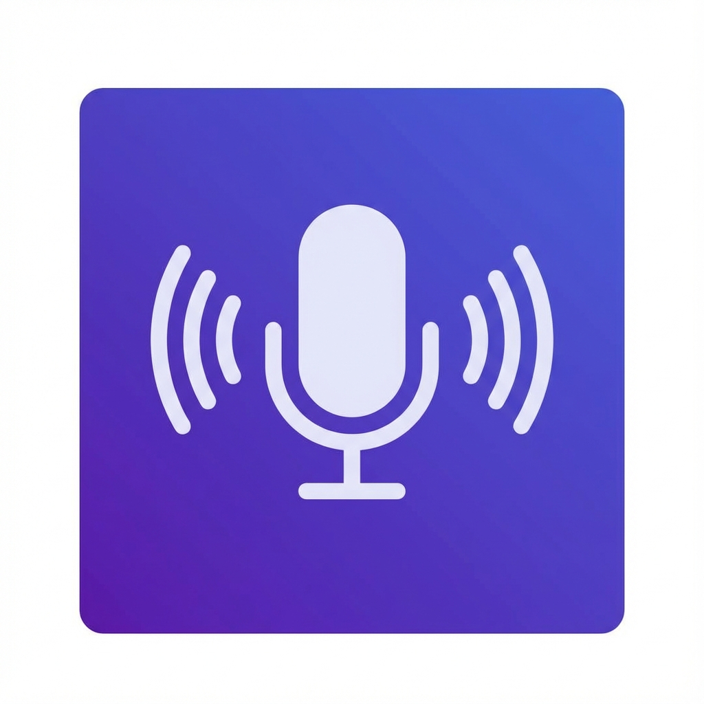

<p align="center">
  
</p>

<h1 align="center">Listen</h1>

<p align="center">
  <strong>Voice-to-Text for Linux</strong><br>
  Fast, private, offline transcription powered by Whisper AI
</p>

<p align="center">
  <a href="https://github.com/abubakerKhaled/listen/releases"></a>
  <a href="LICENSE"></a>
  <a href="#"></a>
</p>

---

## ✨ Features

| Feature | Description |
|---------|-------------|
| 🖥️ **Modern GUI** | GTK4/libadwaita interface with real-time waveform visualization |
| 🎤 **Flexible Recording** | Push-to-talk or toggle mode |
| 🧠 **Local AI** | Uses faster-whisper — no internet required |
| 📋 **Clipboard Integration** | Transcribed text is auto-copied |
| 🎯 **Smart Model Selection** | Auto-selects optimal model based on GPU memory |
| 🌍 **Multilingual Support** | Enhanced Arabic support with language detection |
| 📦 **Portable** | Single AppImage runs on any Linux distro |

---

## 🤖 Smart Model Selection

Listen automatically selects the optimal Whisper model based on your hardware:

| GPU Memory | Model | Best For |
|------------|-------|----------|
| 4GB+ VRAM | `medium` | Best accuracy for Arabic & multilingual |
| 2GB+ VRAM | `small` | Good balance of speed & accuracy |
| <2GB VRAM | `base` | Lightweight GPU processing |
| CPU only | `tiny` | Fast CPU inference |

**Arabic Optimizations:**

- Increased beam search for complex scripts
- Hallucination prevention for Arabic text
- Automatic language detection (shows "Arabic detected" after transcription)

---

## 🚀 Quick Start

**One-command install with desktop integration:**

```bash
git clone https://github.com/abubakerKhaled/listen.git && cd listen && ./setup.sh
```

Or install globally (requires sudo):

```bash
sudo wget -qO /usr/local/bin/listen https://github.com/abubakerKhaled/listen/releases/download/v1.0.0/listen-1.0.0-x86_64.AppImage && sudo chmod +x /usr/local/bin/listen
```

Run it:

```bash
listen
```

> **Note:** First run downloads the AI model (~40-150MB). Subsequent runs are instant.

---

## 📦 Installation

### Unified Setup Script (Recommended)

```bash
git clone https://github.com/abubakerKhaled/listen.git
cd listen
./setup.sh
```

| Option | Description |
|--------|-------------|
| `./setup.sh` | Build (if needed) and install with desktop integration |
| `./setup.sh --system` | System-wide install to `/usr/local/bin` (requires sudo) |
| `./setup.sh --build-only` | Only build the AppImage |
| `./setup.sh --install-only` | Install existing AppImage |
| `./setup.sh --update` | Check for and install updates |

<details>
<summary><strong>Manual installation</strong></summary>

```bash
# Download
wget https://github.com/abubakerKhaled/listen/releases/download/v1.0.0/listen-1.0.0-x86_64.AppImage

# Install globally
sudo mv listen-1.0.0-x86_64.AppImage /usr/local/bin/listen
sudo chmod +x /usr/local/bin/listen
```

</details>

<details>
<summary><strong>User-only (no sudo)</strong></summary>

```bash
mkdir -p ~/.local/bin
wget -qO ~/.local/bin/listen https://github.com/abubakerKhaled/listen/releases/download/v1.0.0/listen-1.0.0-x86_64.AppImage
chmod +x ~/.local/bin/listen

# Add to PATH (if not already)
echo 'export PATH="$HOME/.local/bin:$PATH"' >> ~/.bashrc
source ~/.bashrc
```

</details>

---

## 🔄 Updating

Check for and install updates:

```bash
./setup.sh --update
```

Or if you installed from the repo, pull and reinstall:

```bash
cd listen && git pull && ./setup.sh
```

---

## 📖 Usage

### GUI Mode (Default)

```bash
listen
```

The GUI provides real-time waveform visualization, one-click recording, and automatic clipboard copy.

### CLI Mode

```bash
listen --cli              # Push-to-talk (hold Ctrl+Space)
listen --cli --toggle     # Toggle mode (press to start/stop)
```

### Options

| Option | Description |
|--------|-------------|
| `--cli, -c` | Use terminal interface |
| `--toggle, -t` | Toggle recording mode (CLI only) |
| `--model, -m` | Choose model: `tiny`, `base`, `small`, `medium`, `large-v3` |
| `--no-copy` | Disable auto-copy to clipboard |

### Examples

```bash
listen --model small              # GUI with small model
listen --cli --toggle --no-copy   # CLI toggle without clipboard
```

---

## 🔧 Building from Source

### Prerequisites

```bash
# Ubuntu/Debian
sudo apt install libportaudio2 portaudio19-dev python3-venv \
                 libgtk-4-1 libadwaita-1-0 gir1.2-gtk-4.0 gir1.2-adw-1
```

### Build

```bash
git clone https://github.com/abubakerKhaled/listen.git
cd listen
./build-appimage.sh
```

Creates `listen-1.0.0-x86_64.AppImage` in the project directory.

---

## ❓ Troubleshooting

| Issue | Solution |
|-------|----------|
| First run is slow | Model downloads on first use. Subsequent runs are instant. |
| "No audio captured" | Check mic with `arecord -l`. Ensure PulseAudio/PipeWire is running. |
| Slow on CPU | Use `listen --model tiny` |
| Keyboard shortcut not working | On Wayland, run from terminal with proper permissions |

---

## 🗑️ Uninstall

<details>
<summary><strong>Using uninstall script</strong></summary>

```bash
./uninstall.sh
```

</details>

<details>
<summary><strong>Manual uninstall</strong></summary>

```bash
# Global install
sudo rm /usr/local/bin/listen

# User install
rm ~/.local/bin/listen
rm ~/.local/share/applications/listen.desktop
rm -f ~/.local/share/icons/hicolor/*/apps/listen.png
```

</details>

---

## 🤝 Contributing

Contributions are welcome! Please feel free to submit a Pull Request.

---

## 📄 License

[Apache License 2.0](LICENSE) — free to use, modify, and distribute.

---

<p align="center">
  Made with ❤️ for the Linux community
</p>
