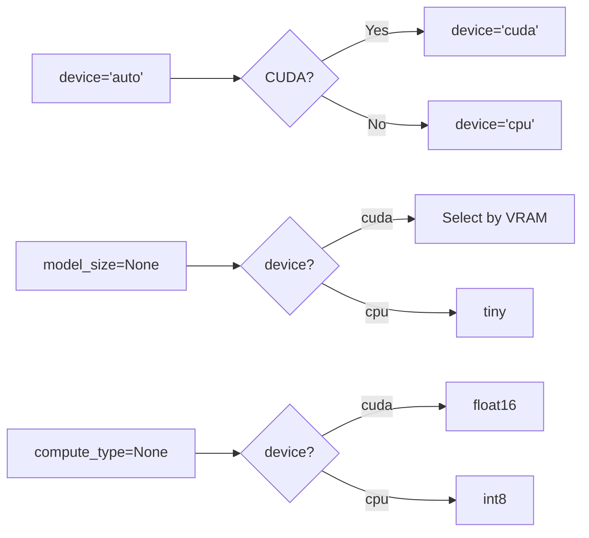

# API Reference

This document provides a complete API reference for developers who want to use Listen's modules programmatically.

---

## 📦 Installation for Development

```bash
# Clone the repository
git clone https://github.com/abubakerKhaled/listen.git
cd listen

# Create virtual environment
python3 -m venv .venv
source .venv/bin/activate

# Install in development mode
pip install -e .
```

---

## 🔌 Quick Start

```python
from listen_app import AudioRecorder, Transcriber

# Record audio
with AudioRecorder() as recorder:
    print("Recording... Press Enter to stop")
    recorder.start()
    input()
    audio_data = recorder.stop()

# Transcribe
transcriber = Transcriber(model_size="small")
result = transcriber.transcribe(audio_data)
print(f"Text: {result.text}")
print(f"Language: {result.language}")
```

---

## 📖 Module: `listen_app`

### Package Exports

```python
from listen_app import (
    AudioRecorder,        # Audio recording functionality
    Transcriber,          # Speech-to-text engine
    TranscriptionResult,  # Result dataclass
    ModelSize,            # Type alias for model sizes
    __version__,          # Package version string
)
```

---

## 🎤 Class: `AudioRecorder`

Records audio from the microphone in WAV format compatible with Whisper.

### Constructor

```python
AudioRecorder(
    on_status_change: Optional[Callable[[str], None]] = None,
    on_audio_chunk: Optional[Callable[[bytes], None]] = None,
)
```

**Parameters**:

| Parameter | Type | Default | Description |
|-----------|------|---------|-------------|
| `on_status_change` | `Callable[[str], None]` | `None` | Callback for status changes ("recording", "stopped") |
| `on_audio_chunk` | `Callable[[bytes], None]` | `None` | Callback for real-time audio data (for waveform) |

### Class Constants

```python
AudioRecorder.SAMPLE_RATE = 16000   # Hz (Whisper requirement)
AudioRecorder.CHANNELS = 1          # Mono
AudioRecorder.CHUNK_SIZE = 1024     # Samples per callback
AudioRecorder.FORMAT = pyaudio.paInt16  # 16-bit signed int
```

### Methods

#### `start(input_device_index=None)`

Start recording audio from the microphone.

```python
def start(self, input_device_index: Optional[int] = None) -> None
```

**Parameters**:

| Parameter | Type | Default | Description |
|-----------|------|---------|-------------|
| `input_device_index` | `int` | `None` | PyAudio device index (None = default) |

**Example**:

```python
recorder = AudioRecorder()
recorder.start()  # Uses default microphone
# or
recorder.start(input_device_index=2)  # Specific device
```

---

#### `stop()`

Stop recording and return the audio data as WAV bytes.

```python
def stop(self) -> bytes
```

**Returns**: WAV file contents as `bytes`

**Example**:

```python
recorder.start()
# ... recording ...
wav_data = recorder.stop()
# wav_data is a complete WAV file in memory
```

---

#### `is_recording()`

Check if currently recording.

```python
def is_recording(self) -> bool
```

**Returns**: `True` if recording is in progress

---

#### `save_to_file(filepath)`

Save the last recording to a WAV file.

```python
def save_to_file(self, filepath: str) -> None
```

**Parameters**:

| Parameter | Type | Description |
|-----------|------|-------------|
| `filepath` | `str` | Path to save the WAV file |

**Example**:

```python
recorder.start()
# ... recording ...
recorder.stop()
recorder.save_to_file("/tmp/recording.wav")
```

---

#### `terminate()`

Clean up PyAudio resources. Called automatically when using context manager.

```python
def terminate(self) -> None
```

---

### Context Manager

`AudioRecorder` supports the context manager protocol:

```python
with AudioRecorder() as recorder:
    recorder.start()
    # ... record ...
    audio = recorder.stop()
# Automatically cleaned up
```

---

### Callback Example

```python
def on_status(status: str):
    print(f"Status: {status}")

def on_chunk(data: bytes):
    # Calculate volume level
    import struct
    samples = struct.unpack(f"{len(data)//2}h", data)
    rms = (sum(s*s for s in samples) / len(samples)) ** 0.5
    print(f"Level: {rms:.0f}")

recorder = AudioRecorder(
    on_status_change=on_status,
    on_audio_chunk=on_chunk
)
```

---

## 🧠 Class: `Transcriber`

Speech-to-text transcription engine using faster-whisper.

### Constructor

```python
Transcriber(
    model_size: Optional[ModelSize] = None,
    device: Literal["auto", "cpu", "cuda"] = "auto",
    compute_type: Optional[str] = None,
)
```

**Parameters**:

| Parameter | Type | Default | Description |
|-----------|------|---------|-------------|
| `model_size` | `ModelSize` | `None` | Model size (auto-select if None) |
| `device` | `str` | `"auto"` | Compute device |
| `compute_type` | `str` | `None` | Precision (auto-select if None) |

**Model Sizes**:

```python
ModelSize = Literal["tiny", "base", "small", "medium", "large-v3"]
```

| Model | Parameters | VRAM | Speed | Accuracy |
|-------|------------|------|-------|----------|
| `tiny` | 39M | ~1GB | ⚡⚡⚡ | ⭐ |
| `base` | 74M | ~1GB | ⚡⚡ | ⭐⭐ |
| `small` | 244M | ~2GB | ⚡ | ⭐⭐⭐ |
| `medium` | 769M | ~4GB | 🐢 | ⭐⭐⭐⭐ |
| `large-v3` | 1550M | ~8GB | 🐢🐢 | ⭐⭐⭐⭐⭐ |

**Compute Types**:

| Type | Device | Description |
|------|--------|-------------|
| `float16` | CUDA | Fast GPU inference |
| `int8` | CPU | Quantized CPU inference |
| `float32` | Both | Full precision (slowest) |

**Auto-Selection Behavior**:



### Methods

#### `transcribe(audio_source, language=None)`

Transcribe audio to text.

```python
def transcribe(
    self,
    audio_source: str | bytes,
    language: Optional[str] = None
) -> TranscriptionResult
```

**Parameters**:

| Parameter | Type | Default | Description |
|-----------|------|---------|-------------|
| `audio_source` | `str \| bytes` | — | File path or WAV bytes |
| `language` | `str` | `None` | Language code (None = auto-detect) |

**Returns**: `TranscriptionResult` object

**Language Codes** (examples):

| Code | Language |
|------|----------|
| `en` | English |
| `ar` | Arabic |
| `fr` | French |
| `es` | Spanish |
| `de` | German |
| `zh` | Chinese |
| `ja` | Japanese |

**Example**:

```python
transcriber = Transcriber(model_size="small")

# From file
result = transcriber.transcribe("/path/to/audio.wav")

# From bytes
result = transcriber.transcribe(wav_bytes)

# Force language
result = transcriber.transcribe(wav_bytes, language="ar")
```

---

#### `get_model_info()`

Get detailed information about the loaded model and device.

```python
def get_model_info(self) -> dict
```

**Returns**:

```python
{
    "model_size": "small",           # Current model
    "device": "cuda",                # cpu or cuda
    "compute_type": "float16",       # Precision
    "gpu_name": "NVIDIA GeForce...", # GPU name (or None)
    "gpu_memory_mb": 2048,           # GPU memory (or None)
    "cuda_version": "12.1",          # CUDA version (or None)
    "driver_version": "535.129.03",  # Driver (or None)
}
```

**Example**:

```python
transcriber = Transcriber()
info = transcriber.get_model_info()

if info["device"] == "cuda":
    print(f"Using GPU: {info['gpu_name']}")
else:
    print("Using CPU inference")
```

---

## 📊 Dataclass: `TranscriptionResult`

Container for transcription results.

```python
@dataclass
class TranscriptionResult:
    text: str                    # Transcribed text
    language: str                # Detected language code
    language_probability: float  # Confidence (0.0 - 1.0)
    duration: float              # Audio duration in seconds
```

**Example**:

```python
result = transcriber.transcribe(audio_data)

print(f"Text: {result.text}")
print(f"Language: {result.language} ({result.language_probability:.1%})")
print(f"Duration: {result.duration:.1f}s")
```

**String Representation**:

```python
str(result)  # Returns result.text
```

---

## 🖥️ Function: `run_gui()`

Entry point for the GUI interface.

```python
from listen_app.gui import run_gui

run_gui(
    model_size: Optional[ModelSize] = None,
    auto_copy: bool = True
)
```

**Parameters**:

| Parameter | Type | Default | Description |
|-----------|------|---------|-------------|
| `model_size` | `ModelSize` | `None` | Initial model (auto if None) |
| `auto_copy` | `bool` | `True` | Auto-copy to clipboard |

**Example**:

```python
from listen_app.gui import run_gui

# Start with medium model, no auto-copy
run_gui(model_size="medium", auto_copy=False)
```

---

## 💻 Function: `main()`

CLI entry point (typically called via `listen` command).

```python
from listen_app.cli import main

main()  # Parses sys.argv
```

---

## 🔧 Complete Example

```python
#!/usr/bin/env python3
"""Example: Transcribe a WAV file and print results."""

from listen_app import Transcriber, TranscriptionResult

def transcribe_file(filepath: str) -> TranscriptionResult:
    """Transcribe a WAV file to text."""
    transcriber = Transcriber(model_size="small")
    
    # Print model info
    info = transcriber.get_model_info()
    print(f"Model: {info['model_size']} on {info['device']}")
    
    # Transcribe
    result = transcriber.transcribe(filepath)
    return result

if __name__ == "__main__":
    import sys
    
    if len(sys.argv) < 2:
        print("Usage: python example.py <audio.wav>")
        sys.exit(1)
    
    result = transcribe_file(sys.argv[1])
    
    print(f"\nTranscription:")
    print(f"  Text: {result.text}")
    print(f"  Language: {result.language}")
    print(f"  Confidence: {result.language_probability:.1%}")
    print(f"  Duration: {result.duration:.1f}s")
```

---

## 🎙️ Complete Recording Example

```python
#!/usr/bin/env python3
"""Example: Record and transcribe with visual feedback."""

import sys
from listen_app import AudioRecorder, Transcriber

def record_and_transcribe():
    """Record from microphone and transcribe."""
    
    # Status callback
    def on_status(status: str):
        print(f"[{status.upper()}]")
    
    # Initialize
    recorder = AudioRecorder(on_status_change=on_status)
    transcriber = Transcriber()
    
    print("Press ENTER to start recording...")
    input()
    
    recorder.start()
    print("Recording... Press ENTER to stop")
    input()
    
    audio_data = recorder.stop()
    recorder.terminate()
    
    print("Transcribing...")
    result = transcriber.transcribe(audio_data)
    
    print(f"\n>>> {result.text}")
    return result.text

if __name__ == "__main__":
    text = record_and_transcribe()
```

---

## 📝 Type Annotations

```python
from typing import Optional, Literal, Callable

# Type alias for model sizes
ModelSize = Literal["tiny", "base", "small", "medium", "large-v3"]

# Callback types
StatusCallback = Callable[[str], None]
AudioChunkCallback = Callable[[bytes], None]
```

---

<p align="center">
  <a href="./decisions.md">← Technical Decisions</a> |
  <a href="./README.md">Index</a> |
  <a href="./build-packaging.md">Build & Packaging →</a>
</p>
