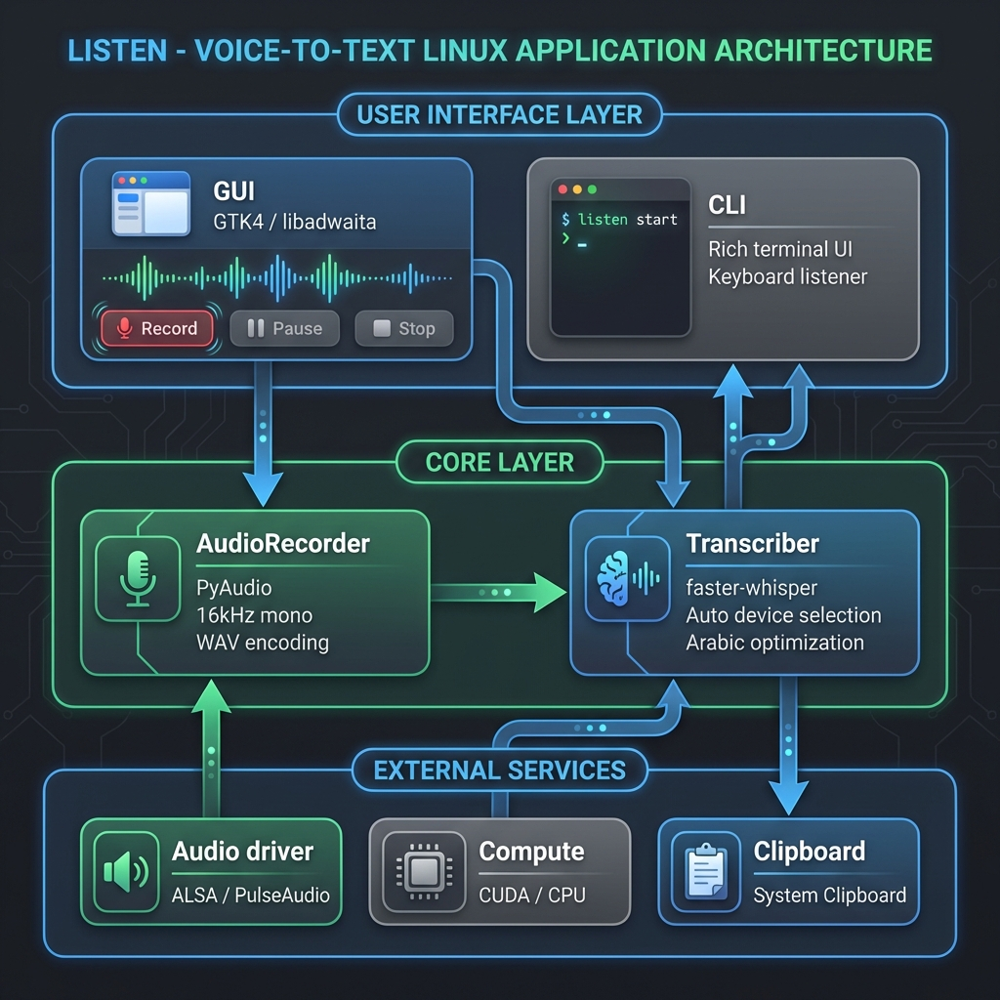
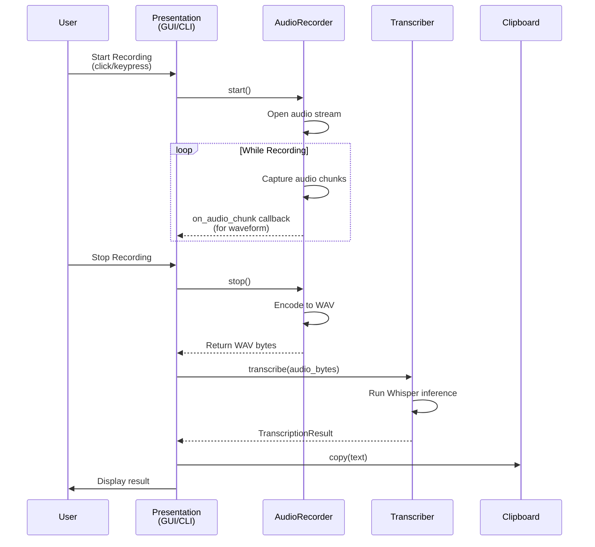
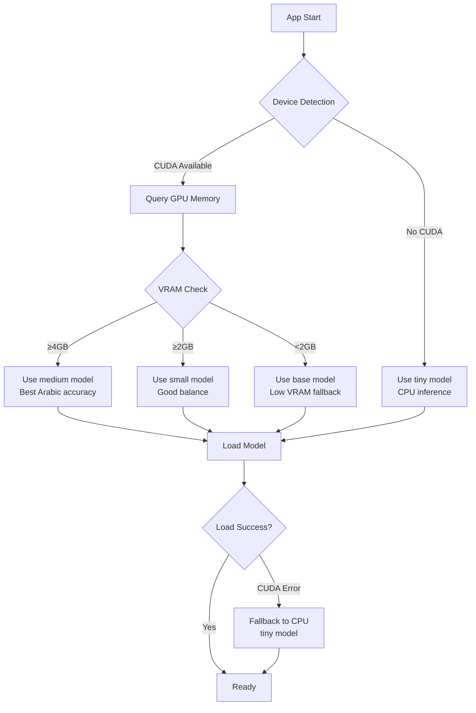
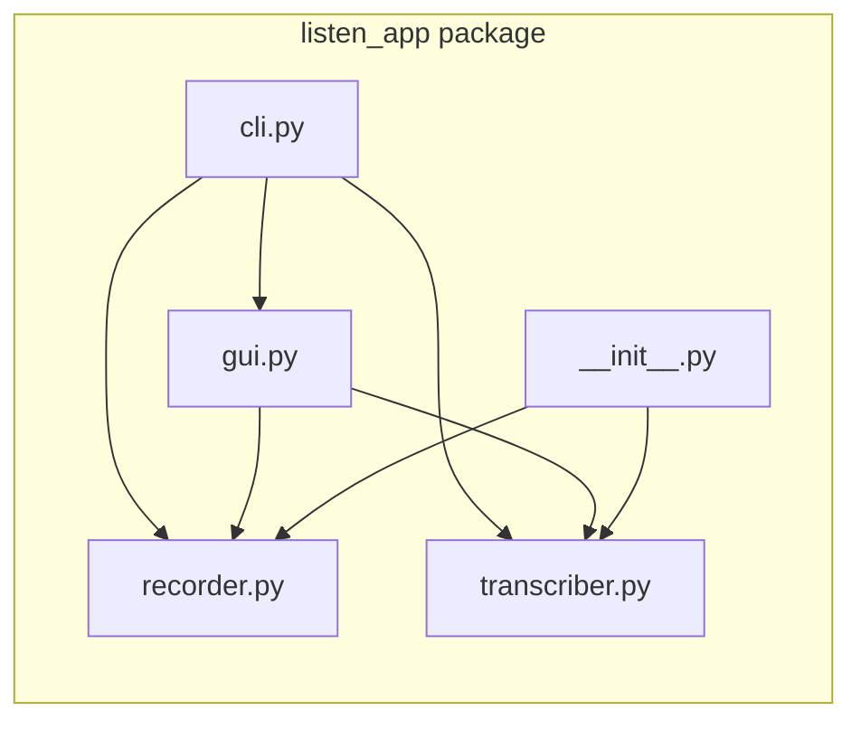

# Architecture Overview

This document describes the system architecture of Listen, including component interactions, data flow, and design patterns used throughout the codebase.

---

## 🎨 Visual Overview

<p align="center">
  
</p>

---

## 🏗️ High-Level Architecture

Listen follows a **modular architecture** with clear separation of concerns. The application consists of three main layers:

```
┌─────────────────────────────────────────────────────────────────┐
│                      Presentation Layer                         │
│   ┌───────────────────────┐    ┌───────────────────────────┐   │
│   │       GUI (GTK4)      │    │       CLI (Rich)          │   │
│   │   • Waveform Display  │    │   • Live Status Panel     │   │
│   │   • Button States     │    │   • Keyboard Listener     │   │
│   │   • Model Selector    │    │   • Toggle/Push-to-talk   │   │
│   └───────────┬───────────┘    └─────────────┬─────────────┘   │
└───────────────┼──────────────────────────────┼─────────────────┘
                │                              │
                └──────────────┬───────────────┘
                               ▼
┌─────────────────────────────────────────────────────────────────┐
│                       Core Layer                                 │
│   ┌───────────────────────┐    ┌───────────────────────────┐   │
│   │    AudioRecorder      │    │      Transcriber          │   │
│   │   • Mic Input         │───▶│   • faster-whisper        │   │
│   │   • WAV Encoding      │    │   • Auto Device Selection │   │
│   │   • Callback System   │    │   • Arabic Optimization   │   │
│   └───────────────────────┘    └───────────────────────────┘   │
└─────────────────────────────────────────────────────────────────┘
                               │
                               ▼
┌─────────────────────────────────────────────────────────────────┐
│                     External Services                           │
│   ┌───────────────────┐  ┌─────────────┐  ┌─────────────────┐  │
│   │   PyAudio/ALSA    │  │  CUDA/CPU   │  │   Clipboard     │  │
│   │   Audio Driver    │  │  Compute    │  │   (pyperclip)   │  │
│   └───────────────────┘  └─────────────┘  └─────────────────┘  │
└─────────────────────────────────────────────────────────────────┘
```

---

## 🧩 Component Diagram

```mermaid
graph TB
    subgraph "Entry Points"
        CLI[cli.py<br/>main()]
        GUI[gui.py<br/>run_gui()]
    end

    subgraph "Presentation"
        ListenApp[ListenApp<br/>CLI Class]
        ListenGUI[ListenGUI<br/>Adw.Application]
        Waveform[WaveformDrawingArea<br/>Gtk.DrawingArea]
    end

    subgraph "Core"
        Recorder[AudioRecorder<br/>PyAudio wrapper]
        Transcriber[Transcriber<br/>faster-whisper]
        Result[TranscriptionResult<br/>dataclass]
    end

    subgraph "System"
        PyAudio[PyAudio/PortAudio]
        Whisper[faster-whisper<br/>CTranslate2]
        Clipboard[pyperclip]
        Keyboard[pynput]
    end

    CLI --> ListenApp
    CLI --> GUI
    ListenApp --> Recorder
    ListenApp --> Transcriber
    ListenApp --> Keyboard
    ListenGUI --> Waveform
    ListenGUI --> Recorder
    ListenGUI --> Transcriber
    Recorder --> PyAudio
    Transcriber --> Whisper
    Transcriber --> Result
    ListenApp --> Clipboard
    ListenGUI --> Clipboard
```

---

## 📊 Data Flow

### Recording & Transcription Flow



### Model Auto-Selection Flow



---

## 🎨 GUI State Machine

The GUI follows a simple **state machine** pattern for the main action button:

```mermaid
stateDiagram-v2
    [*] --> Ready: App Start
    
    Ready --> Recording: Click "Record"
    note right of Ready: Button: "🎤 Record"
    
    Recording --> Transcribing: Click "Transcribe"
    note right of Recording: Button: "⏹️ Transcribe"
    
    Transcribing --> Result: Transcription Complete
    note right of Transcribing: Button: "⏳ Transcribing..."
    
    Result --> Ready: Click "Copy & New"
    note right of Result: Button: "📋 Copy & New Recording"
```

### State Definitions

| State | Button Label | Button Style | Action on Click |
|-------|-------------|--------------|-----------------|
| `STATE_READY` | 🎤 Record | `suggested-action` | Start recording |
| `STATE_RECORDING` | ⏹️ Transcribe | `destructive-action` | Stop & transcribe |
| `STATE_TRANSCRIBING` | ⏳ Transcribing... | disabled | (wait for completion) |
| `STATE_RESULT` | 📋 Copy & New Recording | `suggested-action` | Copy text, reset state |

---

## 🔌 Module Dependencies



### External Dependencies

| Module | External Dependency | Purpose |
|--------|-------------------|---------|
| `cli.py` | `rich`, `pynput`, `pyperclip` | Terminal UI, keyboard, clipboard |
| `gui.py` | `gi.repository.Gtk/Adw`, `pyperclip` | GTK4 UI, clipboard |
| `recorder.py` | `pyaudio` | Audio capture |
| `transcriber.py` | `faster_whisper` | Speech-to-text |

---

## 🧵 Threading Model

Listen uses **threading** for non-blocking operations:

```
┌─────────────────────────────────────────────────────────────────┐
│                        Main Thread                               │
│   • UI rendering (GTK main loop or Rich Live display)           │
│   • User input handling                                          │
│   • State management                                             │
└────────────────────────────┬────────────────────────────────────┘
                             │
            ┌────────────────┼────────────────┐
            ▼                ▼                ▼
   ┌──────────────┐  ┌──────────────┐  ┌──────────────┐
   │ Audio Thread │  │ Model Load   │  │ Transcribe   │
   │ (PyAudio     │  │ Thread       │  │ Thread       │
   │  callback)   │  │ (Background) │  │ (Background) │
   └──────────────┘  └──────────────┘  └──────────────┘
```

### Thread Safety

- **GLib.idle_add**: Used extensively in GUI to safely update UI from background threads
- **threading.Lock**: Protects shared state in `ListenApp` class
- **Daemon threads**: All background threads are daemonic to ensure clean shutdown

---

## 📦 Packaging Architecture

### AppImage Structure

```
listen-1.0.0-x86_64.AppImage
└── squashfs-root/
    ├── AppRun                      # Entry point script
    ├── listen.desktop              # Desktop integration
    ├── listen.png                  # Application icon
    └── usr/
        ├── bin/
        │   └── python3             # Bundled Python interpreter
        └── lib/
            ├── python3.X/
            │   ├── site-packages/  # All Python dependencies
            │   │   ├── listen_app/ # Application code
            │   │   ├── faster_whisper/
            │   │   ├── pyaudio/
            │   │   └── ...
            │   └── (stdlib)        # Python standard library
            ├── girepository-1.0/   # GTK4 typelibs
            └── x86_64-linux-gnu/   # Native libraries
                └── libportaudio*
```

### Installation Paths

| Install Type | Binary Location | Desktop Entry | Icons |
|-------------|-----------------|---------------|-------|
| User | `~/.local/bin/listen` | `~/.local/share/applications/` | `~/.local/share/icons/hicolor/*/apps/` |
| System | `/usr/local/bin/listen` | N/A | N/A |

---

## 🔐 Security Considerations

1. **Local Processing**: All audio is processed locally; no data leaves the machine
2. **Model Caching**: Whisper models are cached in `~/.cache/huggingface/`
3. **Microphone Access**: Requires microphone permissions (handled by PulseAudio/PipeWire)
4. **Keyboard Monitoring**: `pynput` monitors keyboard for hotkeys (CLI mode only)
5. **No Network**: The application works completely offline after initial model download

---

## 🎯 Design Patterns Used

| Pattern | Location | Purpose |
|---------|----------|---------|
| **State Machine** | `gui.py` (ListenGUI) | Button state management |
| **Observer** | `recorder.py` callbacks | Audio chunk notifications |
| **Lazy Loading** | `cli.py` (_get_transcriber) | Defer model loading until needed |
| **Strategy** | `transcriber.py` (device selection) | Auto-select CPU/GPU compute |
| **Factory** | `transcriber.py` (model selection) | Auto-select appropriate model |

---

<p align="center">
  <a href="./README.md">← Back to Index</a> |
  <a href="./modules.md">Core Modules →</a>
</p>
