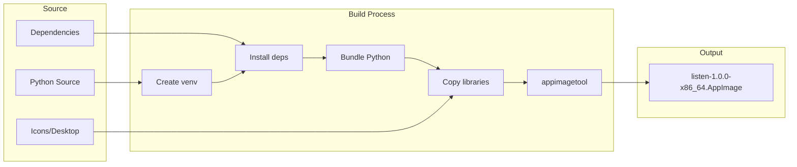
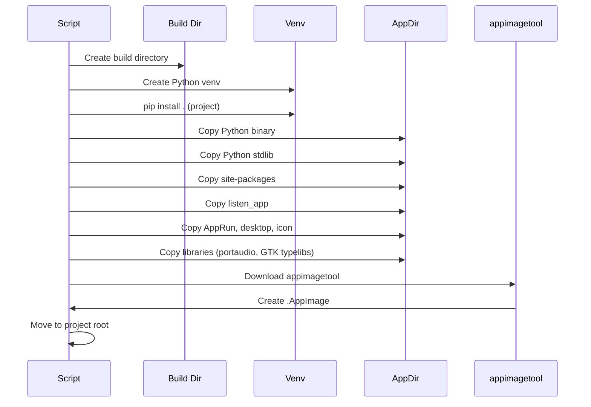
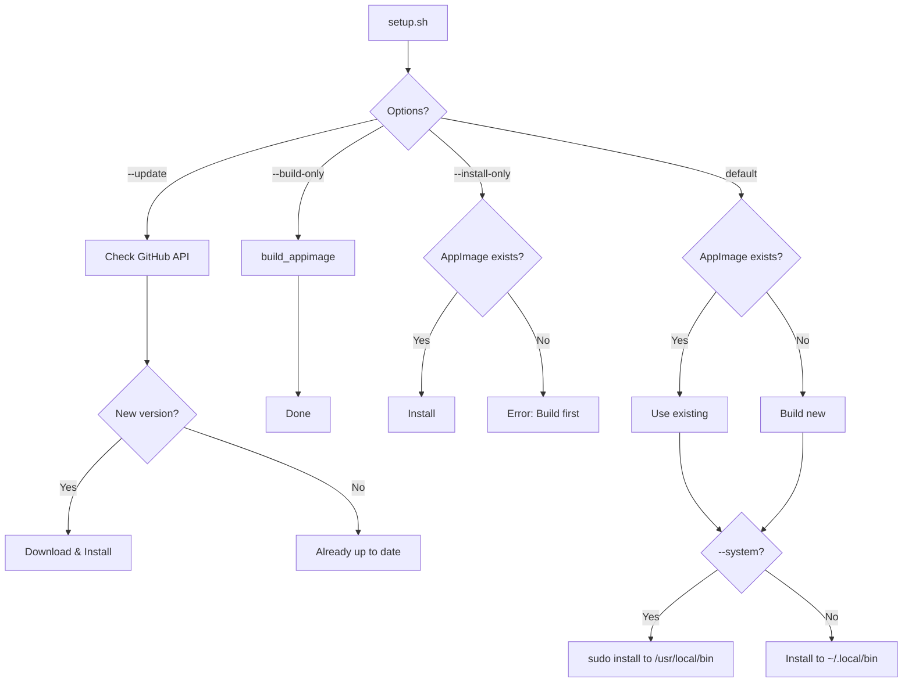
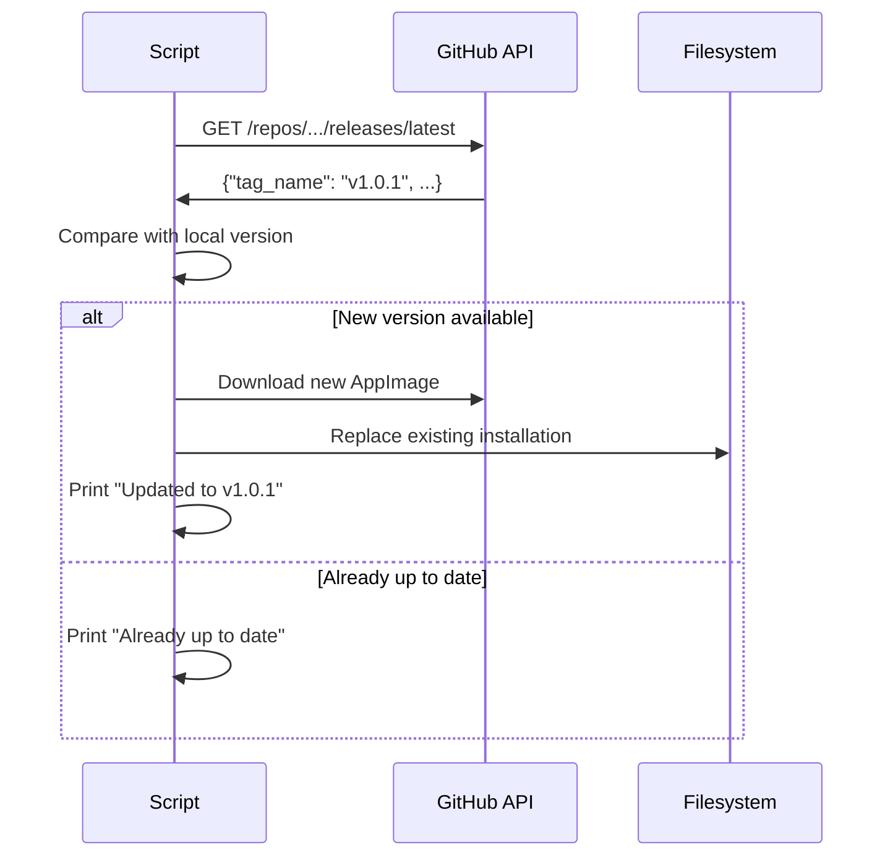

# Build & Packaging Guide

This document explains how Listen is built, packaged, and distributed as an AppImage.

---

## 📦 Distribution Overview

Listen is distributed as an **AppImage** — a single executable file that runs on any Linux distribution.



---

## 🛠️ Build Prerequisites

### System Dependencies

```bash
# Ubuntu/Debian
sudo apt install \
    python3 \
    python3-venv \
    libportaudio2 \
    portaudio19-dev \
    libgtk-4-1 \
    libadwaita-1-0 \
    gir1.2-gtk-4.0 \
    gir1.2-adw-1 \
    wget
```

```bash
# Fedora
sudo dnf install \
    python3 \
    python3-virtualenv \
    portaudio-devel \
    gtk4 \
    libadwaita \
    gobject-introspection
```

### For GPU Support (Optional)

```bash
# NVIDIA CUDA (for faster inference)
# Install NVIDIA drivers and CUDA toolkit
nvidia-smi  # Verify GPU is detected
```

---

## 🔨 Build Scripts

Listen provides two main build scripts:

| Script | Purpose |
|--------|---------|
| `build-appimage.sh` | Build AppImage only |
| `setup.sh` | Build + Install (recommended) |

---

## 📜 build-appimage.sh

Low-level AppImage build script.

### Usage

```bash
./build-appimage.sh
```

### What It Does



### Build Steps (Detailed)

| Step | Description | Files |
|------|-------------|-------|
| 1 | Create Python venv | `build/venv/` |
| 2 | Install dependencies | All pip packages |
| 3 | Bundle Python | `AppDir/usr/bin/python3` |
| 4 | Copy stdlib | `AppDir/usr/lib/python3.X/` |
| 5 | Copy site-packages | All installed packages |
| 6 | Copy application | `listen_app/` module |
| 7 | Copy AppRun/desktop/icon | Entry point files |
| 8 | Copy GTK typelibs | `girepository-1.0/` |
| 9 | Run appimagetool | Creates final AppImage |

### Output

```
listen-1.0.0-x86_64.AppImage  (~180MB)
```

---

## 📜 setup.sh

Unified setup script for build, install, and update.

### Usage

```bash
./setup.sh [OPTIONS]
```

### Options

| Option | Description |
|--------|-------------|
| (none) | Build (if needed) + Install |
| `--build-only` | Only build AppImage |
| `--install-only` | Only install existing AppImage |
| `--system` | System-wide install to `/usr/local/bin` |
| `--update` | Check for GitHub updates |
| `--help` | Show help |

### Examples

```bash
# Full setup (build if needed + install)
./setup.sh

# Just build
./setup.sh --build-only

# Install existing to system
sudo ./setup.sh --system

# Check for updates
./setup.sh --update
```

### Workflow



---

## 📁 AppImage Structure

```
listen-1.0.0-x86_64.AppImage (squashfs)
├── AppRun                          # Entry point script (bash)
├── listen.desktop                  # XDG desktop entry
├── listen.png                      # Application icon (256x256)
└── usr/
    ├── bin/
    │   └── python3                 # Bundled Python interpreter
    └── lib/
        ├── python3.X/
        │   ├── (stdlib modules)    # Python standard library
        │   ├── lib-dynload/        # Built-in C extensions
        │   └── site-packages/
        │       ├── listen_app/     # Our application
        │       ├── faster_whisper/ # Whisper library
        │       ├── ctranslate2/    # CT2 backend
        │       ├── pyaudio.py      # Audio library
        │       ├── pynput/         # Keyboard input
        │       ├── pyperclip/      # Clipboard
        │       ├── rich/           # Terminal formatting
        │       └── ...             # Other dependencies
        ├── girepository-1.0/       # GTK4/Adwaita typelibs
        │   ├── Gtk-4.0.typelib
        │   ├── Adw-1.typelib
        │   └── ...
        └── x86_64-linux-gnu/
            └── libportaudio*       # PortAudio library
```

---

## 🚀 AppRun Entry Point

The `AppRun` script sets up the environment and launches Python:

```bash
#!/bin/bash
APPDIR="$(dirname "$(readlink -f "$0")")"

# Detect Python version
PYTHON_VERSION=$(ls "${APPDIR}/usr/lib/" | grep -E '^python[0-9]+\.[0-9]+$' | head -1)
PYTHON_LIB="${APPDIR}/usr/lib/${PYTHON_VERSION}"

# Environment setup
export PATH="${APPDIR}/usr/bin:${PATH}"
export LD_LIBRARY_PATH="${APPDIR}/usr/lib:${APPDIR}/usr/lib/x86_64-linux-gnu:${LD_LIBRARY_PATH}"
export PYTHONHOME="${APPDIR}/usr"
export PYTHONPATH="${PYTHON_LIB}/site-packages:${PYTHON_LIB}:${PYTHON_LIB}/lib-dynload"
export PYTHONNOUSERSITE=1
export GI_TYPELIB_PATH="${APPDIR}/usr/lib/girepository-1.0:${GI_TYPELIB_PATH}"

# Run application
exec "${APPDIR}/usr/bin/python3" -m listen_app.cli "$@"
```

### Key Environment Variables

| Variable | Purpose |
|----------|---------|
| `PYTHONHOME` | Python installation root |
| `PYTHONPATH` | Module search path (site-packages first!) |
| `PYTHONNOUSERSITE` | Ignore user's `~/.local` packages |
| `LD_LIBRARY_PATH` | Native library search path |
| `GI_TYPELIB_PATH` | GTK introspection typelibs |

---

## 🖼️ Desktop Integration

### listen.desktop

```ini
[Desktop Entry]
Version=1.0
Type=Application
Name=Listen
GenericName=Voice Transcription
Comment=Voice-to-text transcription tool powered by OpenAI Whisper
Exec=${INSTALL_DIR}/listen %U
Icon=listen
Categories=AudioVideo;Audio;Utility;
Terminal=false
Keywords=voice;speech;transcription;whisper;audio;recording;
StartupNotify=true
StartupWMClass=listen
```

### Icon Installation

Icons are installed in multiple sizes:

```
~/.local/share/icons/hicolor/
├── 256x256/apps/listen.png
├── 128x128/apps/listen.png
├── 64x64/apps/listen.png
└── 48x48/apps/listen.png
```

---

## 📥 Install Locations

### User Install (Default)

```
~/.local/bin/listen                      # Executable
~/.local/share/applications/listen.desktop  # Desktop entry
~/.local/share/icons/hicolor/*/apps/listen.png  # Icons
```

### System Install (`--system`)

```
/usr/local/bin/listen                    # Executable (root-owned)
```

---

## 🔄 Update Mechanism

The `--update` flag checks GitHub for new releases:



---

## 🧪 Testing the Build

### Verify AppImage

```bash
# Make executable
chmod +x listen-1.0.0-x86_64.AppImage

# Run directly
./listen-1.0.0-x86_64.AppImage

# Test CLI mode
./listen-1.0.0-x86_64.AppImage --cli --help

# Extract and inspect
./listen-1.0.0-x86_64.AppImage --appimage-extract
ls squashfs-root/
```

### Common Issues

| Issue | Cause | Solution |
|-------|-------|----------|
| "libportaudio not found" | Missing from bundle | Check Step 5 in build |
| "No module named 'gi'" | PyGObject not copied | Verify system packages |
| "cannot execute binary" | Wrong architecture | Build on matching arch |
| FUSE error | FUSE not installed | `sudo apt install fuse` |

---

## 📊 Build Size Breakdown

Approximate sizes of bundled components:

| Component | Size | Notes |
|-----------|------|-------|
| Python stdlib | ~50MB | Core Python |
| faster-whisper | ~30MB | Whisper bindings |
| ctranslate2 | ~40MB | ML backend |
| PyTorch (subset) | ~20MB | Required by CT2 |
| Other packages | ~20MB | rich, pyaudio, etc. |
| Native libs | ~10MB | portaudio, typelibs |
| **Total** | **~180MB** | Compressed squashfs |

> **Note**: Whisper models are downloaded separately on first run and cached in `~/.cache/huggingface/`.

---

## 🎯 Build Best Practices

1. **Build on oldest target distro** — Build on Ubuntu 20.04/22.04 for max compatibility
2. **Use system GTK** — Don't bundle GTK4 (too complex, rely on system)
3. **Bundle native audio libs** — PortAudio is small and avoids version issues
4. **Set PYTHONNOUSERSITE** — Prevents conflicts with user's installed packages
5. **Order PYTHONPATH correctly** — site-packages before stdlib for imports

---

## 🔧 Customizing the Build

### Change Version

Edit `pyproject.toml`:

```toml
[project]
version = "1.0.1"
```

And `build-appimage.sh`:

```bash
APP_VERSION="1.0.1"
```

### Add New Dependencies

1. Add to `pyproject.toml`:

   ```toml
   dependencies = [
       "new-package>=1.0.0",
   ]
   ```

2. Rebuild:

   ```bash
   ./build-appimage.sh
   ```

---

<p align="center">
  <a href="./api-reference.md">← API Reference</a> |
  <a href="./README.md">Index</a> |
  <a href="./contributing.md">Contributing →</a>
</p>
