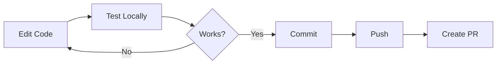
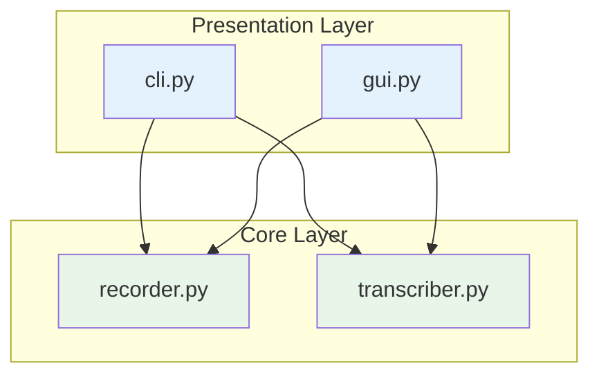
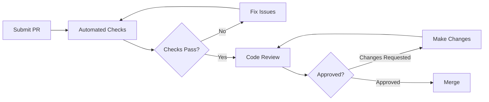

# Contributing Guide

Thank you for your interest in contributing to Listen! This guide will help you get started with development.

---

## 🚀 Getting Started

### Fork & Clone

```bash
# Fork on GitHub, then clone your fork
git clone https://github.com/YOUR-USERNAME/listen.git
cd listen

# Add upstream remote
git remote add upstream https://github.com/abubakerKhaled/listen.git
```

### Development Setup

```bash
# Install system dependencies (Ubuntu/Debian)
sudo apt install \
    python3 python3-venv python3-pip \
    libportaudio2 portaudio19-dev \
    libgtk-4-1 libadwaita-1-0 \
    gir1.2-gtk-4.0 gir1.2-adw-1

# Create virtual environment
python3 -m venv .venv
source .venv/bin/activate

# Install in development mode
pip install -e .

# Run directly
python -m listen_app.cli
# or
listen --cli
```

---

## 📁 Project Structure

```
listen/
├── src/
│   └── listen_app/         # Main Python package
│       ├── __init__.py     # Package exports
│       ├── cli.py          # CLI & entry point
│       ├── gui.py          # GTK4 GUI
│       ├── recorder.py     # Audio recording
│       └── transcriber.py  # Whisper transcription
├── appimage/               # AppImage assets
│   ├── AppRun              # Entry script
│   ├── listen.desktop      # Desktop file
│   └── listen.png          # Icon
├── docs/                   # Documentation
├── build-appimage.sh       # Build script
├── setup.sh                # Setup script
├── install.sh              # Install script
├── uninstall.sh            # Uninstall script
├── pyproject.toml          # Python package config
└── README.md               # Project README
```

---

## 🔧 Development Workflow

### Create a Feature Branch

```bash
# Sync with upstream
git fetch upstream
git checkout main
git merge upstream/main

# Create feature branch
git checkout -b feature/my-awesome-feature
```

### Make Changes



### Testing

```bash
# Run GUI
listen

# Run CLI
listen --cli

# Test with specific model
listen --model tiny --cli

# Test transcription
listen --cli --toggle
# Record some audio and verify output
```

### Commit Changes

```bash
# Stage changes
git add -A

# Commit with descriptive message
git commit -m "feat: add XYZ feature

- Added new functionality
- Updated documentation
- Fixed related issue"

# Push to your fork
git push origin feature/my-awesome-feature
```

---

## 📝 Code Style

### Python Style

We follow **PEP 8** with these specifics:

| Rule | Value |
|------|-------|
| Max line length | 88 (Black default) |
| Quotes | Double quotes `"` |
| Imports | Sorted (isort compatible) |
| Type hints | Required for public APIs |
| Docstrings | Google style |

### Example

```python
"""Module description."""

from typing import Optional

from .module import SomeClass


class MyClass:
    """Class description.
    
    Attributes:
        name: Description of attribute.
    """
    
    def my_method(self, value: str) -> Optional[str]:
        """Method description.
        
        Args:
            value: Description of parameter.
            
        Returns:
            Description of return value.
        """
        if not value:
            return None
        return value.upper()
```

### Formatting Tools (Recommended)

```bash
# Install formatters
pip install black isort

# Format code
black src/
isort src/
```

---

## 🏗️ Architecture Guidelines

### Component Responsibilities



| Layer | Files | Responsibility |
|-------|-------|----------------|
| Presentation | `cli.py`, `gui.py` | User interaction |
| Core | `recorder.py`, `transcriber.py` | Business logic |

### Adding New Features

1. **Core logic** goes in `recorder.py` or `transcriber.py`
2. **UI changes** go in `cli.py` or `gui.py`
3. **Don't duplicate** — both interfaces should use core modules
4. **Thread safety** — use locks for shared state, `GLib.idle_add` for GTK

---

## 🎯 Contribution Areas

### Current Priorities

| Priority | Area | Description |
|----------|------|-------------|
| 🔴 High | Bug fixes | Fix reported issues |
| 🟡 Medium | Documentation | Improve docs, add examples |
| 🟢 Normal | Features | New functionality |

### Beginner-Friendly Issues

Look for issues labeled:

- `good first issue` — Simple, well-defined tasks
- `help wanted` — Community help appreciated
- `documentation` — Docs improvements

### Feature Ideas

| Feature | Complexity | Status |
|---------|------------|--------|
| Keyboard shortcut config | Medium | Open |
| Multiple audio device selection | Medium | Open |
| Export transcription history | Low | Open |
| Hotword detection ("Hey Listen") | High | Not started |
| Speaker diarization | High | Not started |

---

## 🐛 Bug Reports

### Before Reporting

1. Check [existing issues](https://github.com/abubakerKhaled/listen/issues)
2. Try latest version (`./setup.sh --update`)
3. Test with `--model tiny` to rule out GPU issues

### Bug Report Template

```markdown
**Description**
Clear description of the bug.

**Steps to Reproduce**
1. Run `listen --cli`
2. Press Ctrl+Space
3. Speak for 5 seconds
4. Release

**Expected Behavior**
What should happen.

**Actual Behavior**
What actually happens.

**Environment**
- OS: Ubuntu 22.04
- Python: 3.10
- GPU: NVIDIA RTX 3060 / None
- Listen version: 1.0.0

**Logs/Output**
```

Any error messages or logs

```
```

---

## 🔀 Pull Requests

### PR Checklist

- [ ] Code follows style guidelines
- [ ] Tested on my machine
- [ ] Updated documentation if needed
- [ ] Descriptive commit messages
- [ ] No unrelated changes

### PR Template

```markdown
## Description
Brief description of changes.

## Type of Change
- [ ] Bug fix
- [ ] New feature
- [ ] Documentation update
- [ ] Refactoring

## Testing
How did you test this?

## Screenshots (if UI changes)
Before/after screenshots.

## Related Issues
Closes #123
```

### Review Process



---

## 🧪 Testing Guide

### Manual Testing Checklist

| Test | Command | Expected |
|------|---------|----------|
| GUI launches | `listen` | Window opens |
| CLI launches | `listen --cli` | Terminal UI |
| Model loads | Any mode | "Model loaded" message |
| Recording works | Click/hold | Waveform shows |
| Transcription works | Complete recording | Text appears |
| Clipboard copy | After transcription | Text in clipboard |
| Model selector | GUI dropdown | Model reloads |

### Test Different Scenarios

```bash
# CPU-only
CUDA_VISIBLE_DEVICES="" listen --cli

# Different models
listen --model tiny --cli
listen --model large-v3 --cli

# Different languages
# Record in Arabic, verify detection
```

---

## 📚 Documentation

### Documentation Structure

| File | Content |
|------|---------|
| `README.md` | Project index |
| `architecture.md` | System design |
| `modules.md` | Code documentation |
| `decisions.md` | Technical decisions |
| `api-reference.md` | API docs |
| `build-packaging.md` | Build guide |
| `contributing.md` | This file |

### Documentation Style

- Use **Mermaid diagrams** for complex flows
- Include **code examples**
- Add **tables** for comparisons
- Keep paragraphs **short**
- Use **proper headings** (h2, h3)

---

## ❓ Questions?

- **GitHub Issues**: For bugs and features
- **Discussions**: For questions and ideas

---

## 📜 License

By contributing, you agree that your contributions will be licensed under the [Apache License 2.0](../LICENSE).

---

<p align="center">
  <a href="./build-packaging.md">← Build & Packaging</a> |
  <a href="./README.md">Index</a>
</p>

---

<p align="center">
  Thank you for contributing to Listen! 🎉
</p>
