# Technical Decisions

This document explains the rationale behind key architectural and technical decisions made during the development of Listen.

---

## 📋 Decision Log

| ID | Decision | Status | Date |
|----|----------|--------|------|
| D1 | [Use faster-whisper over openai-whisper](#d1-faster-whisper-over-openai-whisper) | ✅ Implemented | 2024 |
| D2 | [GTK4/libadwaita for GUI](#d2-gtk4libadwaita-for-gui) | ✅ Implemented | 2024 |
| D3 | [AppImage for distribution](#d3-appimage-for-distribution) | ✅ Implemented | 2024 |
| D4 | [Automatic model selection](#d4-automatic-model-selection) | ✅ Implemented | 2024 |
| D5 | [Arabic-optimized transcription settings](#d5-arabic-optimized-transcription) | ✅ Implemented | 2024 |
| D6 | [Dual interface (GUI + CLI)](#d6-dual-interface-gui--cli) | ✅ Implemented | 2024 |
| D7 | [State machine for GUI button](#d7-state-machine-for-gui-button) | ✅ Implemented | 2024 |

---

## D1: faster-whisper over openai-whisper

### Context

OpenAI's Whisper model is the industry standard for speech-to-text transcription. There are two main Python implementations:

1. **openai-whisper**: Official OpenAI implementation using PyTorch
2. **faster-whisper**: Community reimplementation using CTranslate2

### Decision

**Use faster-whisper** as the transcription backend.

### Rationale


| Criteria | openai-whisper | faster-whisper | Winner |
|----------|---------------|----------------|--------|
| Inference Speed | Baseline | 4x faster | faster-whisper |
| Memory Usage | High | ~4x lower | faster-whisper |
| Model Compatibility | Native | Full compatibility | Tie |
| Installation Size | ~2GB | ~500MB | faster-whisper |
| GPU Support | CUDA | CUDA + CPU fallback | faster-whisper |

### Consequences

- ✅ Significantly faster transcription
- ✅ Lower memory footprint
- ✅ Smaller installation size
- ⚠️ Depends on CTranslate2 library
- ⚠️ Community-maintained (but very active)

---

## D2: GTK4/libadwaita for GUI

### Context

Multiple GUI frameworks are available for Python on Linux:

- **GTK4/libadwaita**: Native GNOME toolkit
- **Qt/PyQt5/PyQt6**: Cross-platform toolkit
- **Tkinter**: Python's built-in GUI
- **Web-based (Electron/Flask)**: Browser-based UI

### Decision

**Use GTK4 with libadwaita** for the graphical interface.

### Rationale


| Criteria | GTK4/Adwaita | Qt | Tkinter | Electron |
|----------|-------------|-----|---------|----------|
| Native Linux Feel | ⭐⭐⭐ | ⭐⭐ | ⭐ | ⭐ |
| Modern Design | ⭐⭐⭐ | ⭐⭐ | ⭐ | ⭐⭐⭐ |
| Bundle Size | Small (shared libs) | Medium | Tiny | Huge |
| Dark Mode | Automatic | Manual | Limited | Manual |
| Accessibility | Excellent | Good | Limited | Variable |

### Consequences

- ✅ Perfect integration with GNOME/GTK-based desktops
- ✅ Automatic dark mode support
- ✅ Shared libraries (not bundled in AppImage)
- ✅ Modern, professional appearance
- ⚠️ Requires GTK4/libadwaita installed (most distros have it)
- ⚠️ Less ideal on KDE/Qt-based desktops (still works)

---

## D3: AppImage for Distribution

### Context

Linux has multiple packaging formats:

- **AppImage**: Universal, single-file format
- **Flatpak**: Sandboxed with runtime dependencies
- **Snap**: Canonical's sandboxed format
- **Native packages (.deb/.rpm)**: Distribution-specific

### Decision

**Use AppImage** as the primary distribution format.

### Rationale



```mermaid
graph TB
    subgraph "Distribution Requirements"
        R1[Single File Download]
        R2[No Root Required]
        R3[Works on Any Distro]
        R4[Self-Contained]
    end
    
    subgraph "AppImage Benefits"
        B1[✓ One .AppImage file]
        B2[✓ chmod +x and run]
        B3[✓ Universal format]
        B4[✓ Bundles Python + deps]
    end
    
    R1 --> B1
    R2 --> B2
    R3 --> B3
    R4 --> B4
```

| Format | Sandbox | Root Required | Size | Complexity |
|--------|---------|---------------|------|------------|
| AppImage | No | No | ~180MB | Low |
| Flatpak | Yes | No | ~300MB+ | Medium |
| Snap | Yes | No | ~400MB+ | Medium |
| .deb/.rpm | No | Yes | Variable | High |

### Consequences

- ✅ Single file, easy to download and run
- ✅ No installation required
- ✅ Works on Ubuntu, Fedora, Arch, etc.
- ✅ User can keep multiple versions
- ⚠️ Larger file size (~180MB due to bundled Python)
- ⚠️ GTK4/libadwaita must be system-installed

---

## D4: Automatic Model Selection

### Context

Whisper models range from "tiny" (39M parameters) to "large" (1.5B parameters). Users have varying hardware capabilities.

### Decision

**Automatically select the optimal model** based on detected hardware.

### Rationale



<p align="center">
  
</p>

```mermaid
flowchart TD
    A[App Start] --> B{CUDA Available?}
    B -->|No| C[tiny model<br/>CPU inference]
    B -->|Yes| D[Query VRAM]
    D --> E{VRAM ≥ 4GB?}
    E -->|Yes| F[medium model<br/>Best Arabic accuracy]
    E -->|No| G{VRAM ≥ 2GB?}
    G -->|Yes| H[small model<br/>Good balance]
    G -->|No| I[base model<br/>Low VRAM]
    
    style F fill:#90EE90
    style H fill:#FFEB3B
    style I fill:#FFB74D
    style C fill:#FFB74D
```

**Model Selection Matrix**:

| Device | VRAM | Selected Model | Rationale |
|--------|------|----------------|-----------|
| CUDA | ≥4GB | `medium` | Best accuracy for Arabic/multilingual |
| CUDA | ≥2GB | `small` | Good balance of speed and accuracy |
| CUDA | <2GB | `base` | Fit within limited VRAM |
| CPU | — | `tiny` | Fastest CPU inference |

### Consequences

- ✅ Optimal experience out of the box
- ✅ Users don't need to understand model sizes
- ✅ Prevents OOM errors on low-VRAM GPUs
- ✅ Falls back gracefully to CPU
- ⚠️ Users with specific needs can still override with `--model`

---

## D5: Arabic-Optimized Transcription

### Context

Whisper's default settings work well for English but can produce hallucinations or errors with Arabic and other complex scripts.

### Decision

**Tune transcription parameters for Arabic and RTL languages**.

### Implementation

```python
segments, info = self._model.transcribe(
    audio_source,
    beam_size=8,                        # Up from 5
    patience=1.5,                       # Up from 1.0
    condition_on_previous_text=False,   # Prevents hallucination
    vad_filter=True,                    # Filter silence
)
```

### Rationale

| Parameter | Default | Optimized | Why |
|-----------|---------|-----------|-----|
| `beam_size` | 5 | 8 | Arabic has complex morphology; wider search helps |
| `patience` | 1.0 | 1.5 | More thorough search for script variations |
| `condition_on_previous_text` | True | **False** | Prevents Arabic hallucination (repetition loops) |
| `vad_filter` | False | **True** | Reduces false transcriptions from silence |

### Consequences

- ✅ Significantly improved Arabic transcription quality
- ✅ Reduced hallucination/repetition issues
- ✅ Works well for all languages (not just Arabic)
- ⚠️ Slightly slower inference due to larger beam size
- ⚠️ May skip some context with `condition_on_previous_text=False`

---

## D6: Dual Interface (GUI + CLI)

### Context

Users have different preferences and use cases:

- Some prefer graphical interfaces for ease of use
- Power users and automation require CLI access
- Some desktop environments work better with CLI

### Decision

**Provide both GUI and CLI interfaces** with the same core functionality.

### Architecture


### Consequences

- ✅ GUI for general users
- ✅ CLI for terminal enthusiasts and automation
- ✅ Shared core logic (no duplication)
- ✅ Same features available in both modes
- ⚠️ CLI-specific features (push-to-talk) require `pynput`
- ⚠️ GUI requires GTK4/libadwaita

---

## D7: State Machine for GUI Button

### Context

The GUI has a single main action button that handles multiple functions: record, transcribe, and copy.

### Decision

**Implement a state machine** for the button behavior.

### State Diagram

```mermaid
stateDiagram-v2
    [*] --> Ready
    
    Ready --> Recording: Click
    Recording --> Transcribing: Click
    Transcribing --> Result: Complete
    Result --> Ready: Click
    
    note right of Ready
        Button: "🎤 Record"
        Style: suggested-action
    end note
    
    note right of Recording
        Button: "⏹️ Transcribe"
        Style: destructive-action
    end note
    
    note right of Transcribing
        Button: "⏳ Transcribing..."
        State: disabled
    end note
    
    note right of Result
        Button: "📋 Copy & New"
        Style: suggested-action
    end note
```



<p align="center">
  
</p>

### Rationale

| Approach | Pros | Cons |
|----------|------|------|
| Multiple buttons | Clear actions | Cluttered UI |
| Modal dialogs | Separation | Disruptive |
| **Single stateful button** | Clean UI, guided flow | Requires state management |

### Consequences

- ✅ Clean, minimal UI with single main action
- ✅ Guided user flow (can't skip steps)
- ✅ Clear visual feedback (colors, labels change)
- ✅ Easy to understand workflow
- ⚠️ Slightly more complex code (state management)

---

## 📚 Future Considerations

### Potential Future Decisions

| Topic | Options | Status |
|-------|---------|--------|
| Multi-language UI | gettext, hardcoded | Not started |
| Hotword detection | Always-on mic, wake word | Not started |
| Speaker diarization | Pyannote, whisperx | Not started |
| Cloud sync | Dropbox, Google Drive | Not planned |

---

<p align="center">
  <a href="./modules.md">← Core Modules</a> |
  <a href="./README.md">Index</a> |
  <a href="./api-reference.md">API Reference →</a>
</p>
