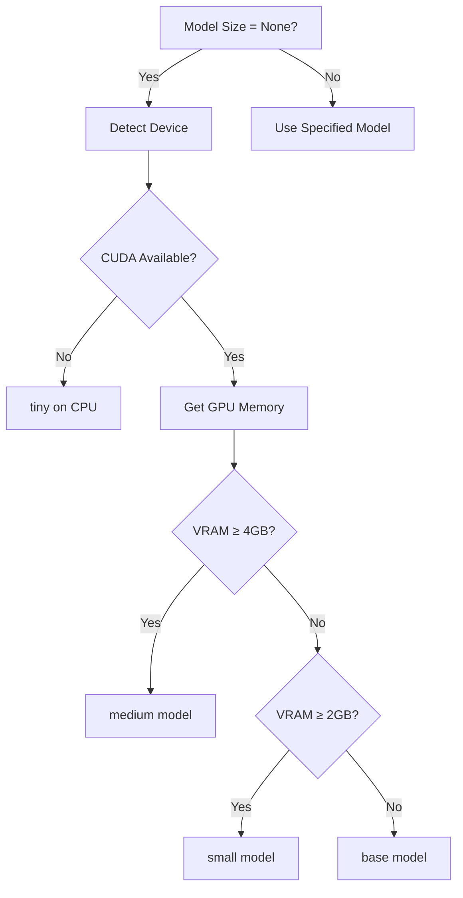
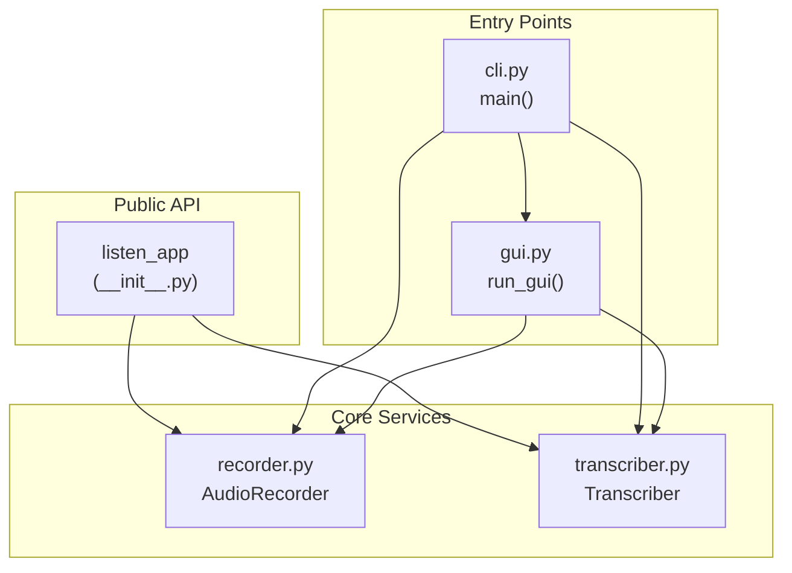

# Core Modules Documentation

This document provides detailed documentation for each module in the `listen_app` package.

---

## 📁 Module Overview

| Module | Lines | Purpose |
|--------|-------|---------|
| [`cli.py`](#clipy) | ~310 | CLI entry point, terminal interface, and keyboard handling |
| [`gui.py`](#guipy) | ~465 | GTK4/libadwaita graphical user interface |
| [`recorder.py`](#recorderpy) | ~170 | Audio recording with PyAudio |
| [`transcriber.py`](#transcriberpy) | ~230 | Whisper-based speech-to-text transcription |
| [`__init__.py`](#__init__py) | ~15 | Package exports and version |

---

## cli.py

**Purpose**: Main entry point for the application. Provides both CLI-based terminal interface and routing to GUI mode.

### Classes

#### `ListenApp`

Main application class for the terminal-based voice-to-text interface.

```python
class ListenApp:
    """Main application for voice-to-text transcription."""
    
    def __init__(
        self,
        model_size: Optional[ModelSize] = None,
        toggle_mode: bool = False,
        auto_copy: bool = True,
    )
```

**Attributes**:

| Attribute | Type | Description |
|-----------|------|-------------|
| `toggle_mode` | `bool` | Toggle mode vs push-to-talk |
| `auto_copy` | `bool` | Auto-copy transcription to clipboard |
| `_running` | `bool` | Application running state |
| `_recording` | `bool` | Currently recording state |
| `_processing` | `bool` | Currently processing audio |
| `_last_transcription` | `str` | Last transcribed text |
| `_last_language` | `str` | Detected language code |
| `_recorder` | `AudioRecorder` | Audio recording instance |
| `_transcriber` | `Transcriber` | Transcription engine (lazy loaded) |

**Key Methods**:

| Method | Description |
|--------|-------------|
| `run()` | Start the main application loop |
| `_get_transcriber()` | Lazy-load the Whisper model |
| `_start_recording()` | Begin audio capture |
| `_stop_recording_and_transcribe()` | Stop recording and transcribe |
| `_get_display()` | Generate Rich panel for terminal display |

### Functions

#### `main()`

CLI entry point that parses arguments and launches appropriate interface.

```python
def main():
    """CLI entry point."""
    parser = argparse.ArgumentParser(...)
    # Routes to ListenApp (CLI) or run_gui() based on --cli flag
```

**Command-Line Arguments**:

| Argument | Short | Description |
|----------|-------|-------------|
| `--cli` | `-c` | Use terminal interface instead of GUI |
| `--toggle` | `-t` | Use toggle mode (press to start/stop) |
| `--model` | `-m` | Whisper model size |
| `--no-copy` | — | Disable auto-clipboard copy |

---

## gui.py

**Purpose**: Modern GTK4/libadwaita graphical user interface with waveform visualization.

### Classes

#### `WaveformDrawingArea`

Custom GTK widget for displaying real-time audio waveform.

```python
class WaveformDrawingArea(Gtk.DrawingArea):
    """Custom widget for displaying audio waveform."""
    
    def __init__(self)
```

**Key Methods**:

| Method | Description |
|--------|-------------|
| `add_samples(audio_data: bytes)` | Add audio samples for visualization |
| `clear()` | Clear the waveform display |
| `_draw(area, cr, width, height)` | Cairo draw function |

**Visualization Details**:

- Background: Dark theme (`rgb(0.1, 0.1, 0.15)`)
- Waveform: Green color (`rgb(0.4, 0.8, 0.4)`)
- Mirrored display for visual balance
- Maximum 100 samples displayed

---

#### `ListenGUI`

Main GTK4 application class.

```python
class ListenGUI(Adw.Application):
    """GTK4 GUI for the Listen voice-to-text application."""
    
    # States for the button cycle
    STATE_READY = "ready"
    STATE_RECORDING = "recording"
    STATE_TRANSCRIBING = "transcribing"
    STATE_RESULT = "result"
```

**UI Components**:

| Component | Type | Purpose |
|-----------|------|---------|
| `window` | `Adw.ApplicationWindow` | Main window |
| `device_info_label` | `Gtk.Label` | GPU/CPU status display |
| `waveform` | `WaveformDrawingArea` | Audio visualization |
| `status_label` | `Gtk.Label` | Current status text |
| `action_button` | `Gtk.Button` | Main action (record/transcribe/copy) |
| `result_label` | `Gtk.Label` | Transcription result display |
| `model_dropdown` | `Gtk.DropDown` | Model size selector |

**State Machine**:

```
STATE_READY → STATE_RECORDING → STATE_TRANSCRIBING → STATE_RESULT → STATE_READY
```

**Key Methods**:

| Method | Description |
|--------|-------------|
| `_on_activate(app)` | Initialize the main window |
| `_load_model(model_size)` | Load Whisper model in background |
| `_start_recording()` | Begin audio capture |
| `_stop_and_transcribe()` | Stop recording and process |
| `_transcribe_audio()` | Background transcription worker |
| `_on_transcription_complete()` | Handle result on main thread |
| `_copy_and_reset()` | Copy to clipboard and reset state |

### Functions

#### `run_gui()`

Entry point for GUI mode.

```python
def run_gui(model_size: Optional[ModelSize] = None, auto_copy: bool = True):
    """Entry point for GUI mode."""
    app = ListenGUI(model_size=model_size, auto_copy=auto_copy)
    app.run_app()
```

---

## recorder.py

**Purpose**: Audio recording module with PyAudio for microphone input.

### Classes

#### `AudioRecorder`

Records audio from microphone with callback support.

```python
class AudioRecorder:
    """Records audio from the microphone with push-to-talk support."""
    
    # Whisper expects 16kHz mono audio
    SAMPLE_RATE = 16000
    CHANNELS = 1
    CHUNK_SIZE = 1024
    FORMAT = pyaudio.paInt16
```

**Constants**:

| Constant | Value | Description |
|----------|-------|-------------|
| `SAMPLE_RATE` | 16000 | Whisper's expected sample rate |
| `CHANNELS` | 1 | Mono audio |
| `CHUNK_SIZE` | 1024 | Samples per callback |
| `FORMAT` | `paInt16` | 16-bit signed integer |

**Constructor**:

```python
def __init__(
    self,
    on_status_change: Optional[Callable[[str], None]] = None,
    on_audio_chunk: Optional[Callable[[bytes], None]] = None,
)
```

**Key Methods**:

| Method | Returns | Description |
|--------|---------|-------------|
| `start(input_device_index=None)` | `None` | Start recording |
| `stop()` | `bytes` | Stop and return WAV data |
| `is_recording()` | `bool` | Check recording state |
| `save_to_file(filepath)` | `None` | Save last recording to file |
| `terminate()` | `None` | Clean up PyAudio resources |

**ALSA Error Suppression**:

The recorder includes a context manager `_alsa_error_handler()` to suppress noisy ALSA library warnings that pollute stderr on Linux systems.

```python
def _alsa_error_handler(self):
    """Context manager to suppress ALSA error messages to stderr."""
    # Temporarily redirects stderr to /dev/null during PyAudio init
```

**Context Manager Support**:

```python
with AudioRecorder() as recorder:
    recorder.start()
    # ... recording logic ...
    audio_data = recorder.stop()
# Automatically terminates
```

---

## transcriber.py

**Purpose**: Speech-to-text transcription using faster-whisper with automatic device and model selection.

### Type Aliases

```python
ModelSize = Literal["tiny", "base", "small", "medium", "large-v3"]
```

### Dataclasses

#### `TranscriptionResult`

Result of a transcription operation.

```python
@dataclass
class TranscriptionResult:
    text: str                    # Transcribed text
    language: str                # Detected language code (e.g., 'en', 'ar')
    language_probability: float  # Confidence in language detection
    duration: float              # Audio duration in seconds
```

### Classes

#### `Transcriber`

Main transcription engine wrapping faster-whisper.

```python
class Transcriber:
    """Transcribes audio to text using faster-whisper."""
    
    def __init__(
        self,
        model_size: Optional[ModelSize] = None,
        device: Literal["auto", "cpu", "cuda"] = "auto",
        compute_type: Optional[str] = None,
    )
```

**Auto-Selection Logic**:



**Key Methods**:

| Method | Returns | Description |
|--------|---------|-------------|
| `transcribe(audio_source, language=None)` | `TranscriptionResult` | Transcribe audio |
| `get_model_info()` | `dict` | Get model and device info |
| `_detect_device()` | `str` | Detect CPU/CUDA availability |
| `_get_gpu_memory()` | `int` | Query GPU memory in MB |
| `_detect_best_model(device)` | `str` | Select optimal model |

**Arabic Optimization**:

The transcriber uses special settings optimized for Arabic and other complex scripts:

```python
segments, info = self._model.transcribe(
    audio_source,
    language=language,
    beam_size=8,                        # Increased for complex scripts
    patience=1.5,                       # More thorough search
    condition_on_previous_text=False,   # Prevents hallucination
    vad_filter=True,                    # Filter silence
)
```

**CUDA Fallback**:

If CUDA libraries are missing (common in AppImage), the transcriber gracefully falls back to CPU:

```python
try:
    self._model = WhisperModel(model_size, device=device, ...)
except Exception as e:
    if "cuda" in str(e).lower():
        # Fall back to CPU with tiny model
        self._model = WhisperModel("tiny", device="cpu", compute_type="int8")
```

---

## \_\_init\_\_.py

**Purpose**: Package initialization and public API exports.

```python
"""Listen - Voice-to-text transcription tool for Linux."""

__version__ = "1.0.0"

from .recorder import AudioRecorder
from .transcriber import Transcriber, TranscriptionResult, ModelSize

__all__ = [
    "AudioRecorder",
    "Transcriber",
    "TranscriptionResult",
    "ModelSize",
    "__version__",
]
```

**Exported Symbols**:

| Symbol | Type | Description |
|--------|------|-------------|
| `AudioRecorder` | class | Audio recording functionality |
| `Transcriber` | class | Speech-to-text engine |
| `TranscriptionResult` | dataclass | Transcription result container |
| `ModelSize` | type alias | Valid model size strings |
| `__version__` | str | Package version |

---

## 📊 Module Interaction Diagram



---

<p align="center">
  <a href="./architecture.md">← Architecture</a> |
  <a href="./README.md">Index</a> |
  <a href="./decisions.md">Technical Decisions →</a>
</p>
